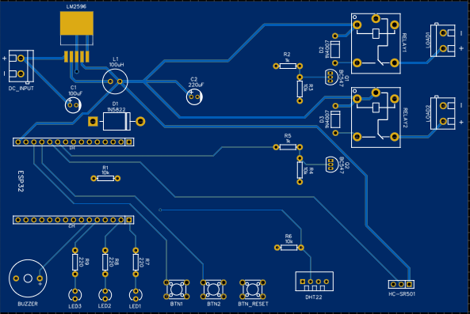
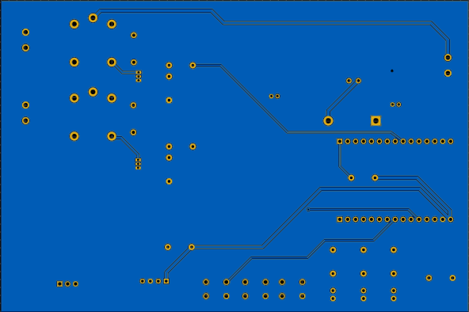
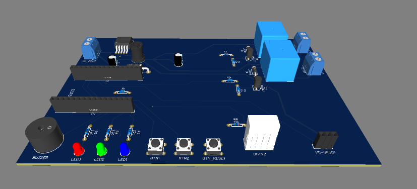
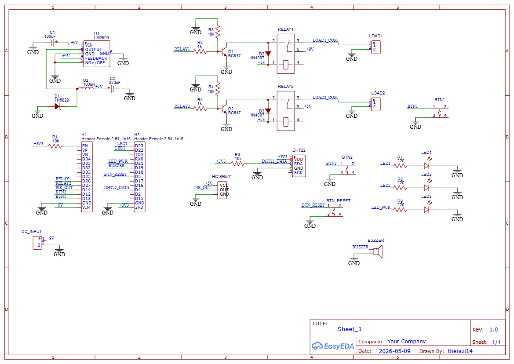

# NexHub v1

A prototype automation hub designed as a learning exercise in PCB design and a foundation for NexHub v2.

---

## Overview

NexHub v1 is a custom PCB designed in EasyEDA around an ESP32 WROOM-32 dev board. It controls two relay channels (a fan and an LED strip) based on temperature/humidity readings from a DHT22 sensor and presence detection from a PIR sensor. Relay states can also be controlled manually via push buttons or remotely via MQTT and a Blynk dashboard.

This version was intentionally kept simple as the goal was to practice PCB layout, component selection, and power regulation before building a more complex v2.

---

## Hardware

| Component | Part | Purpose |
|---|---|---|
| Microcontroller | ESP32 WROOM-32 | Main MCU, WiFi, MQTT |
| Power regulation | LM2596S-5.0 (TO-263) | 9V to 5V buck converter |
| Relay drivers | BC547 + 1N4007 | Discrete transistor switching with flyback protection |
| Relays | SRD-05VDC-SL-C × 2 | Switching fan and LED strip |
| Temperature sensor | DHT22 | Temperature and humidity readings |
| Presence sensor | HC-SR501 | PIR motion detection |
| Status LEDs | 5mm × 3 | Power indicator (1) + relay state indicators (2) |
| Buttons | 6×6mm tactile × 3 | Manual relay override + reset |
| Buzzer | Active buzzer | Fault alerts |
| Power input | DC-099 panel mount | 9V DC barrel jack |
| Output connectors | KF301 screw terminals × 2 | Load connections |

**Board size:** 150 × 100mm, 2-layer FR4

---

## PCB

The PCB was designed from scratch in EasyEDA Standard. Key design decisions:

- LM2596S buck converter (switching regulator) chosen over linear 7805 to reduce heat dissipation at higher current draws
- Discrete relay drivers (BC547 transistors + flyback diodes) instead of a relay module, for a cleaner single-board design
- GND copper pour on bottom layer
- Power traces (9V, 5V) at 0.8mm, signal traces at 0.3mm
- ESP32 dev board socketed via female pin headers for easy replacement

Gerber files are in the `/Gerber` folder. EasyEDA project exported as `EasyEDA.json`.

---

## Firmware (planned)

NexHub v1 was a PCB-only exercise, so the firmware was not written for this version. NexHub v2 will include full firmware with MQTT, Blynk dashboard, and an on-device rule engine.

---

## Power

- Input: 9V DC via DC-099 panel mount jack
- Regulation: LM2596S steps 9V to 5V for ESP32 and relay coils
- Relay outputs are switched 9V (fan on channel 1, 5V LED strip on channel 2)

---

## Why v1?

NexHub v1 served its purpose as a PCB design exercise, but it has clear limitations. Using the ESP32 dev board instead of the bare WROOM-32 module wastes significant board space and means the PCB is essentially a carrier board rather than a complete standalone design. Only 2 relay channels limits practical use. No OLED for local feedback. NexHub v2 addresses these by integrating the bare module directly, adding its own USB-to-UART flashing circuit, more relay channels, and a proper enclosure design.